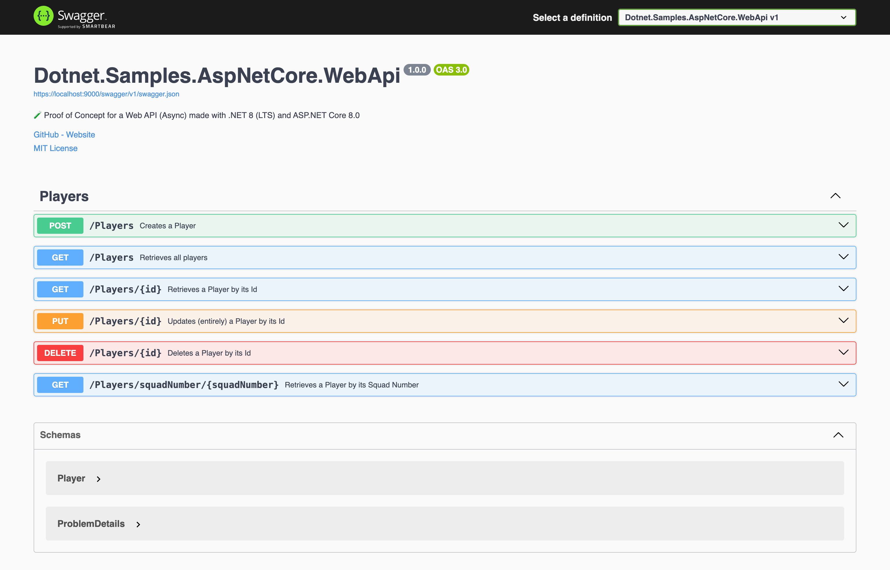

# 🧪 Web API made with .NET 8 (LTS) and ASP.NET Core 8.0

## About

Proof of Concept for a Web API made with [ASP.NET Core 8.0](https://learn.microsoft.com/en-us/aspnet/core/release-notes/aspnetcore-8.0?view=aspnetcore-8.0) targeting [.NET 8](https://learn.microsoft.com/en-us/dotnet/core/whats-new/dotnet-8) inspired by the official guide: [Create a web API with ASP.NET Core](https://learn.microsoft.com/en-us/aspnet/core/tutorials/first-web-api?view=aspnetcore-8.0&tabs=visual-studio-code).

## Start

```console
dotnet watch run --project Dotnet.Samples.AspNetCore.WebApi/Dotnet.Samples.AspNetCore.WebApi.csproj
```

## Documentation

```console
https://localhost:9000/swagger/index.html
```



## Credits

The solution has been coded using [Visual Studio Code](https://code.visualstudio.com/) with the [C# Dev Kit](https://marketplace.visualstudio.com/items?itemName=ms-dotnettools.csdevkit) extension.


